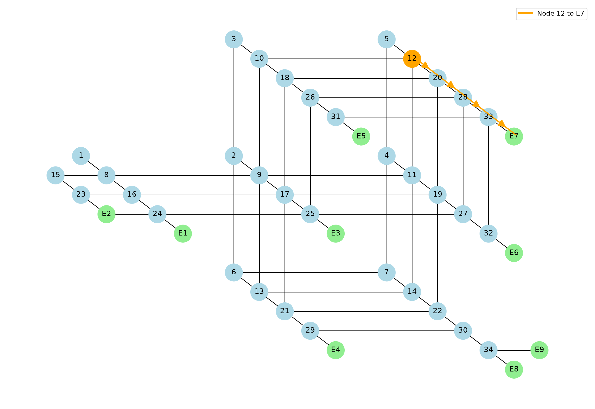
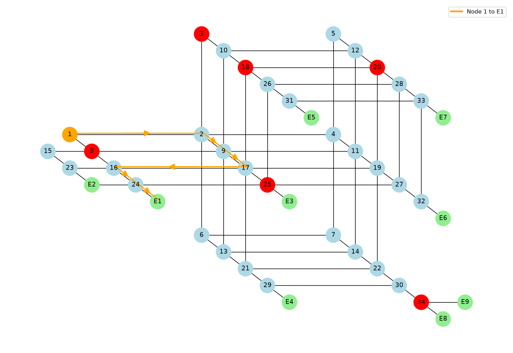
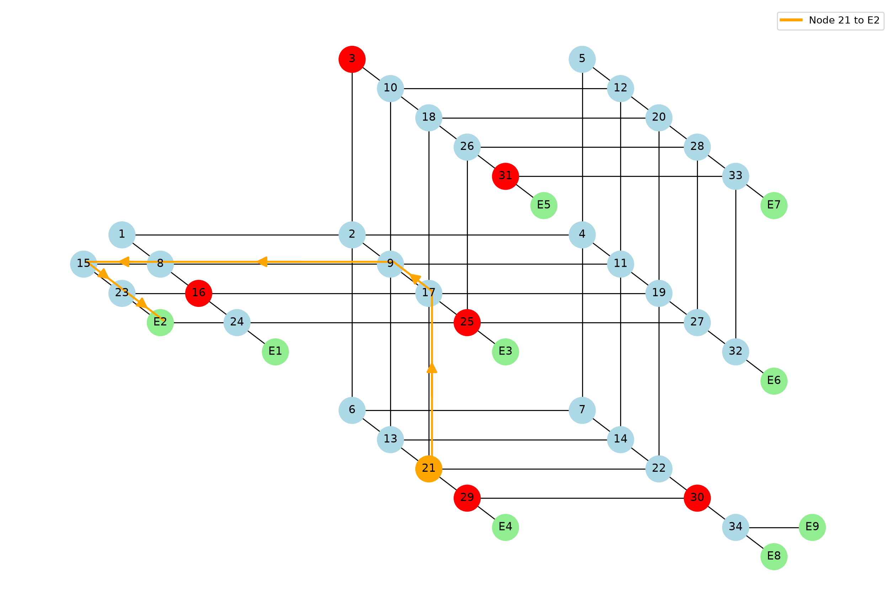

# Dynamic Evacuation Plan Using Dijkstra's Algorithm

Code for the KNUST BSc Mathematics project *Dynamic Evacuation Plan for a Building Complex Using Network Optimisation* (Alfreda Ofori Appiah and Prince Asumadu, 2026).

The Aboagye Menyah Complex is modelled as a weighted, undirected graph. Nodes are intersections (`1`–`34`) and the nine exits (`E1`–`E9`). Edge weights are measured distances in metres. Dijkstra's algorithm finds the shortest route from any node to any exit. Passing a set of blocked nodes gives the dynamic plan: the shortest route that avoids them.



*The network with the offline shortest route from node 12 to exit E7. Exits are green and the source is orange.*

## Files

| File | Purpose |
|---|---|
| `dijkstra.py` | `dijkstra(graph, source, destination, blocked=None)` returns the shortest path as a list of nodes, or `None` if there is no route. `path_length(graph, path)` returns its length in metres. |
| `graph_data.py` | `ABComplex_data`: the building graph as `{node: {neighbour: metres}}`. `graph_data` is a small unused test graph. |
| `graph.py` | `build_graph(source, destination, blocked=None, save_path=None)` draws the network with matplotlib and highlights the route. Blocked nodes are red, the source is orange and exits are green. With `save_path` it saves a PNG instead of opening a window. |
| `run_simulations.py` | Runs random blocked-node scenarios for every node and saves the plots (see below). |

## Setup

```bash
pip install -r requirements.txt
```

## Usage

Offline (static) plan:

```python
from graph_data import ABComplex_data as G
from dijkstra import dijkstra, path_length

path = dijkstra(G, "1", "E1")
print(path, path_length(G, path))   # ['1', '8', '16', '24', 'E1'] 57.37
```

Dynamic plan with blocked nodes (Scenario B from the thesis):

```python
path = dijkstra(G, "12", "E2", blocked={11, 16, 22})
print(path, path_length(G, path))   # 12-20-28-33-31-26-25-24-E2, 128.22
```

Plot a route (`python graph.py` plots node 12 to E7):

```python
from graph import build_graph
build_graph("12", "E2", blocked={11, 16, 22})
```

Node names are strings; `blocked` accepts ints or strings.

## Simulations

`run_simulations.py` tests the dynamic plan on random blockages. For each of the 34 non-exit nodes it:

1. picks a random number of blocked nodes (from `--min-blocked` up to `--max-blocked`) and chooses them at random from the other non-exit nodes. Exits and the source are never blocked;
2. runs Dijkstra from the source to every exit, avoiding the blocked nodes;
3. keeps the exit with the shortest route and plots that one route;
4. redraws the blocked set if no exit can be reached.

```bash
python run_simulations.py --seed 1
```

| Option | Default | Meaning |
|---|---|---|
| `--seed N` | none | Makes a run repeatable. |
| `--min-blocked N` | 2 | Fewest nodes blocked in one scenario. |
| `--max-blocked N` | 6 | Most nodes that can be blocked in one scenario. |
| `--runs N` | 1 | Scenarios per source node. |
| `--out DIR` | `simulations` | Output folder. |

Example scenarios:



*Node 1 with 6 nodes blocked (red). Node 8 is on the usual route, so it detours 1→2→9→17→16→24→E1 (103.37 m) instead of 1→8→16→24→E1 (57.37 m).*



*Node 21 with 6 nodes blocked. Node 29 is blocked, so the nearest exit becomes E2, reached via 21→17→9→8→15→23→E2 (115.71 m).*

Output in `simulations/`:

- One PNG per scenario, named `<source>_to_<exit>_blocked_<nodes>.png`, for example `5_to_E7_blocked_9_19_20_25_27_30.png`. Blocked nodes are red, and arrowheads show the direction of travel.
- `summary.csv` with the source, chosen exit, number of blocked nodes, the blocked nodes, the path and its distance in metres.

Blocked nodes are random, so some don't touch the shortest route and the image matches the offline plan. The `simulations/` folder is git-ignored.


## License

MIT. See [LICENSE](LICENSE).
